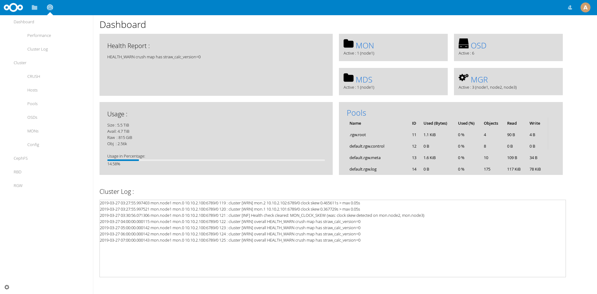

# Nextcloud Ceph Administrator

Here's my first attempt on making a NextCloud App, while at the same time using this project as my final paper to get my Bachelor Degree in Telecommunication Engineering, so don't expect a lot out of it. 

It's a simple Ceph Administrator App. Compatible with NextCloud Version 14.

 

## How to Install?

### Prepare Ceph MGR
The restful module can be enabled by using:
```
# ceph mgr module enable restful
```

All connections to restful are secured with SSL. You can generate a self-signed certificate with the command:
```
# ceph restful create-self-signed-cert
```

Configure where the IP and Port will be listened by typing these commands:
```
# ceph config set mgr mgr/restful/server_addr $IP
# ceph config set mgr mgr/restful/server_port $PORT
```
By default, restful will listen on port 8003.

Create a user for Self Signed Certificate usage:
```
# ceph restful create-key admin
79b51cd9-348e-4822-92e0-25dfec5221b4
```
Keep this user and password for later use.

After the restful plugin is launched, verify through a browser and input the recently made user and password for basic auth:
```
https://10.10.2.100:9005/

{
    "api_version": 1,
    "auth": "Use \"ceph restful create-key <key>\" to create a key pair, pass it as HTTP Basic auth to authenticate",
    "doc": "See /doc endpoint",
    "info": "Ceph Manager RESTful API server"
}
```
## App Installation
Place this app in **nextcloud/apps/**